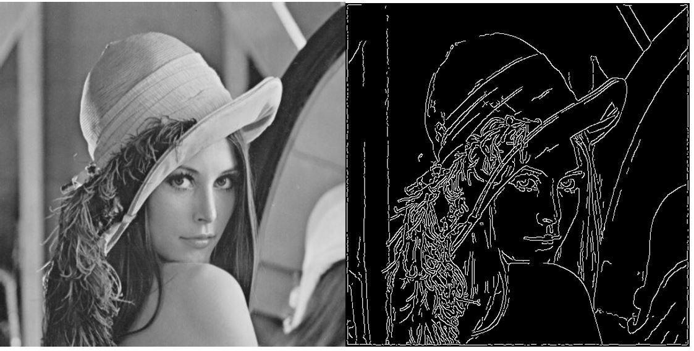

# Autonomous Runway Detection for IoT

## Overview:

This project makes you take a step into the most modern edge of software development for embedded systems, we implement a system for IoT-based autonomous aircraft landing for future airliners. In other words, a system based on embedded real-time processing devices, secure web connectivity and  cloud-based high performance back ends. The project does not only focus on the implementation of the algorithms in these parts, but also something every embedded software designer faces sooner or later: the  interfacing of the parts. Creativity and innovation are the key points to succeed as we give you free hands to  pick all the software pieces together, and you show us the result of you innovative thinking in a project which can be applied in real industrial products today. 

### **Project goals:**

- Setup and implement a real-world embedded system
- Evaluate a real-world embedded system
- Design and argue for their design choices
- Verify the implemented system
- Use the RSA algorithm
- Use the Canny filter
- Compare the output from different inputs using the RSA algorithm
- Evaluate the output image from the Canny filter
- Implement and integrate components in a large scale system and argue for/against implementation choices
- Implement communication interfaces between multiple actors in an embedded system

### Initial steps done to start the project:

Firstly, to load the Project FreeRTOS_Plus_TCP_and_FAT_Windows_Simulator as suggested in the video and try to rebuild. However when clicked on the play button, it used to error out by saying “winpcap.dll was not found“. Then, I had to install winpcap third party executable to get it going. Then, moved the struct defines in rsa.c and canny.c to its respective header file (rsa.h, canny.h) so that it can be used by other files.

Before starting the project, I removed the unnecessary function calls/functions like “prvCreateDiskAndExampleFiles” or “prvServerWorkTask” and irrelevant demo enabled tasks like mainCREATE_UDP_CLI_TASKS or mainCREATE_FTP_SERVER.
Following the lecture, below are the phases which needs to be completed.

#### PHASE 1: 

#### 1. Create needed FreeRTOS tasks and integrate edge detection.

For canny.c to compile, #define _USE_MATH_DEFINES needs to be added as the error – “M_PI as unidentified identifier” will be thrown. Also, the below line throws an error “cannot allocate the array of constant size 0”, so malloc needs to be used.

float kernel[n * n]; // variable length array
change to
float *kernel = malloc(n * n * sizeof(float));

Also, I moved all the defines/declaration in canny.c to canny.h.
Finally, created a task named – vEdgeDetectionTask with priority 5. The job of main() in canny.c is now moved to this task. So, basically this task would load the bmp file, detects edges and then saves it onto a bmp file.

Also, I resolved most of the warnings in canny.c.
#define ENABLE_CANNY in FreeRTOSConfig.h will start the edge detection task.
Commenting this define would disable edge detection feature.
Edge detection is given a priority of 5 and it can be changed in FreeRTOSConfig.h
#define EDGE_DETECTION_TASK_PRIORITY 5

#### 2. Demonstrate working edge detection on a picture

Attached below is the comparison between the original picture and the edge detected picture of lenna.bmp.

 

#### **Fig 1:** Before and after edge detection images of “lenna.bmp”

  

#### **Fig 2:** Comparison of before and after edge detection image file in beyond compare software

 

#### 3. Demonstrate edge detection with real time requirement of 25 pictures per second.

Since the project did not contain 25 pictures. I made a copy of the same lenna.bmp file 25 times and renamed all to bmp_file (x).bmp where x is an incremental number from 1 to 25. These were then copied onto the folder – “Original_Bmp_Files_lenna”. I tried using the “ff_findfirst” to read file names from the directory, but was in vain. Hence I had to incrementally provide the file names to load the appropriate image and save onto an output directory.

All the configurations related to edge detection is in canny.h file.

\#define USE_LENNA_IMAGE

\#define NUM_OF_FILES                      25

 

\#ifdef USE_LENNA_IMAGE

​    \#define INPUT_FILE_DIR     "Original_Bmp_Files_lenna"

\#else

​    \#define INPUT_FILE_DIR     "Original_Bmp_Files"

\#endif

 

\#ifdef USE_LENNA_IMAGE

​    \#define OUTPUT_FILE_DIR    "Edge_Detected_Bmp_Files_lenna"

\#else

​    \#define OUTPUT_FILE_DIR    "Edge_Detected_Bmp_Files"

\#endif

\#define FILE_NAME_PATTERN          "bmp_file ("

\#define MAX_CHAR_FILE_PATH           50

 

​           I also downloaded few sample bmp files from the below link and created a folder “Original_Bmp_Files” and copied to it. I renamed them all to bmp_file (x).bmp where x is an incremental number from 1 to 25. 

https://y-link.yokogawa.com/download/program/daq/dxadv/tool/bitmap.zip

 Whenever USE_LENNA_IMAGE macro is defined in canny.h, 25 copies of lenna.bmp will be used from “Original_Bmp_Files_lenna” directory and the output edge detected bmp file will be saved in “Edge_Detected_Bmp_Files_lenna”. However, if this macro is commented, then 25 different downloaded sample images will be used from “Original_Bmp_Files” directory and the output edge detected bmp file will be saved in “Edge_Detected_Bmp_Files”.

 It takes about **4.03 seconds** to detect edges from the high detailed 25 “lenna.bmp” files. However, it takes about **0.8 seconds** to detect edges from the low detailed 25 different downloaded sample bmp files.

Also, it takes more time to rewrite an image onto the same file name. So, once you run the program and if you run the same program again, it will take more time to finish the edge detection.

 Below are the edge detection output files and the program console window for both lenna and sample bmp files.

 

#### **Fig 3:** Edge detection output files for 25 lenna.bmp files and the time taken to process

  

#### **Fig 4:** Edge detection output files for 25 different sample bmp files and the time taken to process

 

#### PHASE 2:

#### 1. Create needed FreeRTOS tasks and integrate Encryption

As there are a lot of global variables with just one letter as variable names, it was little difficult to understand initially. However, after the wiki link was read, it was easy.

 I moved all the defines/declaration in rsa.c to rsa.h and then finally created a task named – **vRsaEncryptionTask** with priority 5. The job of main() in rsa.c is now moved to this task. So, basically this task would take in the prime numbers (p and q) and then starts the RSA encryption on it.

 Also, I resolved all the warnings in rsa.c. 

**#define ENABLE_RSA** in FreeRTOSConfig.h will start the rsa encryption task. 

Commenting this define would disable rsa encryption feature.

Commenting **#define ENABLE_CANNY** in FreeRTOSConfig.h will disable the edge detection task and hence enables the functionality to ask the user for P, Q prime numbers and Message as the inputs.

 Also, prime numbers are hard coded to 11 and 23. It can be configured in rsa.h file.

 

\#define FIRST_PRIME_P         11

\#define SECOND_PRIME_Q      23

 

Both RSA and Edge detection are given the same priority as they are dependent on each other and more/less takes the same amount of time to finish the execution. The priority can be changed in FreeRTOSConfig.h

\#define RSA_ENCRYPTION_TASK_PRIORITY    5

 

#### 2. Demonstrate working algorithm on data.

Below is the output of the encryption and decryption when 211 is provided as P, 11 as Q and HELLO as the message. This can be obtained by disabling canny and enabling only rsa in FreeRTOSConfig.h

//#define ENABLE_CANNY

\#define ENABLE_RSA

 

####  **Fig 5:** Demo of working RSA encryption algorithm

  

#### 3. Create a communication channel between the edge detection and rsa encryption task and demonstrate correctly sent data

QUEUE has been used to establish a communication channel between vEdgeDetectionTask and vRsaEncryptionTask. 

 

edge_encrypt_queue_handle = **xQueueCreate**(3, sizeof(pack_data_t));

 

where pack_data_t is defined as

typedef struct {

​    pixel_t out_data[DATA_SIZE];

 } pack_data_t ;

 

This enables the queue to hold data of 3 different images of size – DATA_SIZE.

 

​    In the vEdgeDetectionTask, after saving the output file, the data is sent to vRsaEncryptionTask through the **xQueueSend** API using the created queue handle. In vRsaEncryptionTask , **xQueueReceive** API is used to receive the data.

 

Since each image sends data of around 300000 size (size can be found from ih.bmp_bytesz), for the demo it wont make sense to print all those data along with 300000 encryption and decryption data. Instead, just for the demo, I am using certain data indices from the array, to compare between what is sent from vEdgeDetectionTask  and what is received in vRsaEncryptionTask. This can be configured in FreeRTOSConfig.h.  Also, the corresponding demo logs will be enabled only if the ENABLE_DEMO_LOGGING is defined in FreeRTOSConfig.h

Also, a delimiter is defined to identify the message size on the receiving end. Delimiter is made sure to be unique character to avoid losing the real data. 

DATA_SIZE_DELIMITER can be configured in canny.h.

 

\#define ENABLE_DEMO_LOGGING

\#define DEMO_DATA_INDEX_1  10

\#define DEMO_DATA_INDEX_2  100

\#define DEMO_DATA_INDEX_3  1063

\#define DEMO_DATA_INDEX_4  1080

#define DATA_SIZE_DELIMITER         '~' 

 

Enable ENABLE_DECRYPTION macro to ensure the encrypted message is actually good to decrypt.

 Also, this RSA task stores the encrypted data of each bmp file in a .txt file as this would be required to compare between what is sent to the server from the tcp client. This can be enabled/disabled by the macro ENCRYPT_DATA_TO_FILE in FreeRTOSConfig.h.

 Creating a folder through FreeRTOS file system APIs were an issue as it was always returning -1. So we need to make sure that the folder named “encrypt_data” is already present in “FreeRTOS_Plus_TCP_and_FAT_Windows_Simulator” before enabling the macro ENCRYPT_DATA_TO_FILE.

  

#### **Fig 6:** Communication between the tasks through Queue

 

#### 4. Demonstrate encryption with real time requirement of 25 frames per second

As this is only encryption and the decryption needs to happen on the remote end. The macro ENABLE_DECRYPTION needs to be commented. It is taking about 8.3 seconds to detect edge and encrypt 25 files. However, it takes about 1.7 seconds for the downloaded 25 sample bmp files.

 

#### **Fig 7:** Encrypting 25 real time lenna pictures

  

#### **Fig 8:** Encrypting 25 downloaded sample bmp files

 

#### PHASE 3:

#### 1. Configure FreeRTOS to use network sockets

Since the project asked us to open the demo FreeRTOS_Plus_TCP_and_FAT_Windows_Simulator, most of the configurations were already taken care of. However, the main configuration through which the actual network hardware could be used, needed to be configured. Below macro was 4L which did not work for my machine, so I had to change it to the correct number as per what comes up in the console.

\#define configNETWORK_INTERFACE_TO_USE 2L

 

TCP related task can be enabled/disabled with the macro ENABLE_TCP.

Tcp client is given a bit more priority than the rest of the task as it takes more time to connect to the socket and then send the data while compared to other tasks. This can be changed in FreeRTOSConfig.h

\#define TCP_CLIENT_TASK_PRIORITY        8

  

## 2. Implement TCP Client in FreeRTOS

Once the proper network interface is chosen, now a FreeRTOS task needs to be created to Send the encrypted data through TCP making it as a TCP client. However, this task needs to be created only after the network is up, so the task creation is added in vApplicationIPNetworkEventHook function which says whether the network is connected/disconnected.

 vTcpSendDataTask is the task created in a new file named tcp_client.c where it is constantly looking for data to be received through rsa queue (encrypt_tcp_queue_handle). Once the data is received through the queue, it needs to be transmitted through TCP connection (vTCPSend). In this function, it creates a socket with the specified port and tries to connect to the server address mentioned in the tcp_client.h configuration file.

 

\#define config_SERVER_PORT   8002

 

\#define config_SERVER_ADDR0  192

\#define config_SERVER_ADDR1  168

\#define config_SERVER_ADDR2  1

\#define config_SERVER_ADDR3  196

 

#### **Fig 9:** Network Interface display to choose the right one

 

By default, these will be 0 and will tell the user to enter the proper server port and address in order to complete the project’s functionality. In order to find the server address, do an “ipconfig” on a command line and find the correct IPv4 address of the same PC. In TCP client, it tries to connect to the server, if success, then it sends all the data to the server before closing the socket or else it will be stuck trying to find the server.

 

#### 3. Implement TCP Server

Here, TCP Server was implemented using JAVA as it was more easier to implement. Found an example online and have added the same in the reference. However, added more functionality to it to take in the port through command line and to create a file as and when the data is received through TCP.

This TCP server creates a folder named “encrypt_data”, if not created before and then stores the received data in different files. It creates “encrypted_filex.txt” where x is the file number in “encrypt_data” folder. 

 For this tcp_server.java to be compiled, open the command line and call **javac** tcp_server.java. This compiles the program. However, to run the program, you need to call the below command.

Java TCPServer xxxx

 Where xxxx is the port number same as what is configured in (FreeRTOS) TCP Client through #define config_SERVER_PORT.

 

#### **Fig 10:** Working of TCP Server

 

#### 4. Stream encrypted frames from FreeRTOS to PC

Below is the image of the working project where it reads the bmp files from the folder “Original_Bmp_Files” and detects the edge, copies it to “Edge_Detected_Bmp_Files” folder and then encrypts the data, copies it to “encrypt_data” and then transmits the same data to the server through TCP communication.

 

#### **Fig 11:** Complete working of Edge detection, RSA Encryption and TCP client

 

#### 5. Verify the frames

I verified the transmission of reception of the correct data with the help of the tool “Beyond Compare”. 

On the FreeRTOS side, it creates a folder named “encrypt_data” with multiple files before sending it over to server through TCP. In the same way, the TCP server shall create a folder named “encrypt_data” with multiple files when the data is received. The file names in both these folders are meant to be the same so that it is easier for the tool to compare.

Once the project is run on FreeRTOS and Server side, the created folders are compared using the tool which shows the difference between the files if any. If there are any difference, those files will be shown in red.

 

#### **Fig 12:** Created files in “encrypt_data” folder

 

#### **Fig 13:** Beyond compare tool showing the results of comparison

  

#### **Fig 14:** Beyond compare of a particular file showing no difference in the data

 

#### 6. Choice of Hardware:

​       I would use the hardware STM32F407 for this use case as it has both camera and ethernet interface which is what I mainly required here. The STM32F407 is a high powered μC with an ARM Cortex M4 processor running at 168 MHz. The development board available has 1 Mb of onchip flash and 192 kB of SRAM. Also, the performance of this chip looks good enough for the work we need to for this project. It is a 32 bit cortex M4 core with RAM good enough for the FreeRTOS to run. These chips have different operating modes. So, with low power mode, it can take as little as 1 μA. However, for the run mode, it can take up to 10mA.

Also the camera module OV2640 can be attached to this STM chip in order to get the frames to be processed. Maximum resolution of this cam is about 1600 x 1200 UXGA at 15 fps.

Output support for Raw RGB, RGB (RGB565/555),GRB422,YUV (422/420) and YCbCr (4:2:2) formats.

Also, the ethernet supports about 10/100 Mbit/s data transfer rates with external PHY interfaces. The hardware seems to be pretty reliable with all the features intact. 

The total cost including the development kit and the camera module would come around 21 + 10 = **$32.**

However, doesn’t take into account the internet plans.

 

## How to Build and Run the project

Below are the steps to follow in order to run/test this project

1. First enter the TCP port and address of your PC in tcp_client.h file. Port can be 8002, while the IP address needs to be your PCs address found through ipconfig. You can either use the same PC or a different PC for the TCP server, but the address is what matters.

2. Then compile the FreeRTOS project from Visual Studio.

3. Compile the TCP server program by going into “tcp_server” folder and doing a javac tcp_server.java. Ignore this step if you do not want to compile freshly and want to run the compiled program directly.

4. Delete the files inside the folder “encrypt_data” in both tcp_server and FreeRTOS_Plus_TCP_and_FAT_Windows_Simulator projects. Ignore this step if you don’t mind looking at overwritten files.

5. Delete the files inside the folder “Edge_Detected_Bmp_Files” and “Edge_Detected_Bmp_Files_lenna” in FreeRTOS_Plus_TCP_and_FAT_Windows_Simulator projects. Ignore this step if you don’t mind looking at overwritten files.

6. Run the server first by entering the below command with the same port configured in step 1
    java TCPServer PORT

7. Run the FreeRTOS Project

8. Look at the consoles in both, the client and server to understand what is happening.

9. The TCP server will terminate after crating 25 files and the FreeRTOS Project will say “All Tasks complete” which confirms that all the 25 file TCP transmission and reception are complete

10. If you have the tool – “Beyond Compare”, use it to compare the “encrypt_data” folder created in both tcp_server and FreeRTOS_Plus_TCP_and_FAT_Windows_Simulator projects to see if there are any difference.

11. Hopefully, no differences.

12. I have enabled the sample downloaded bmp files to be encrypted and sent, if you want to try the 25 lenna images which was given as part of the project, uncomment the below macro, recompile and rerun the project.
    //#define USE_LENNA_IMAGE

    

## References:

1. https://www.freertos.org/a00106.html

2. https://www.freertos.org/FreeRTOS-Plus/FreeRTOS_Plus_TCP/TCP_Networking_Tutorial_TCP_Client_and_Server.html

3. https://systembash.com/a-simple-java-tcp-server-and-tcp-client/

4. https://y-link.yokogawa.com/download/program/daq/dxadv/tool/bitmap.zip

5. https://www.st.com/en/microcontrollers/stm32f4-series.html?querycriteria=productId=SS1577

6. https://www.st.com/content/ccc/resource/technical/document/reference_manual/3d/6d/5a/66/b4/99/40/d4/DM00031020.pdf/files/DM00031020.pdf/jcr:content/translations/en.DM00031020.pdf

7. http://www.arducam.com/camera-modules/2mp-ov2640/

8. https://www.newark.com/webapp/wcs/stores/servlet/Search?storeId=10194&catalogId=15003&langId=-1&mf=100050&st=STM32F407G-DISC1&showResults=true&CMP=AFC-STMICRO